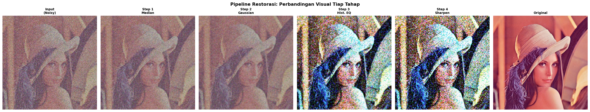
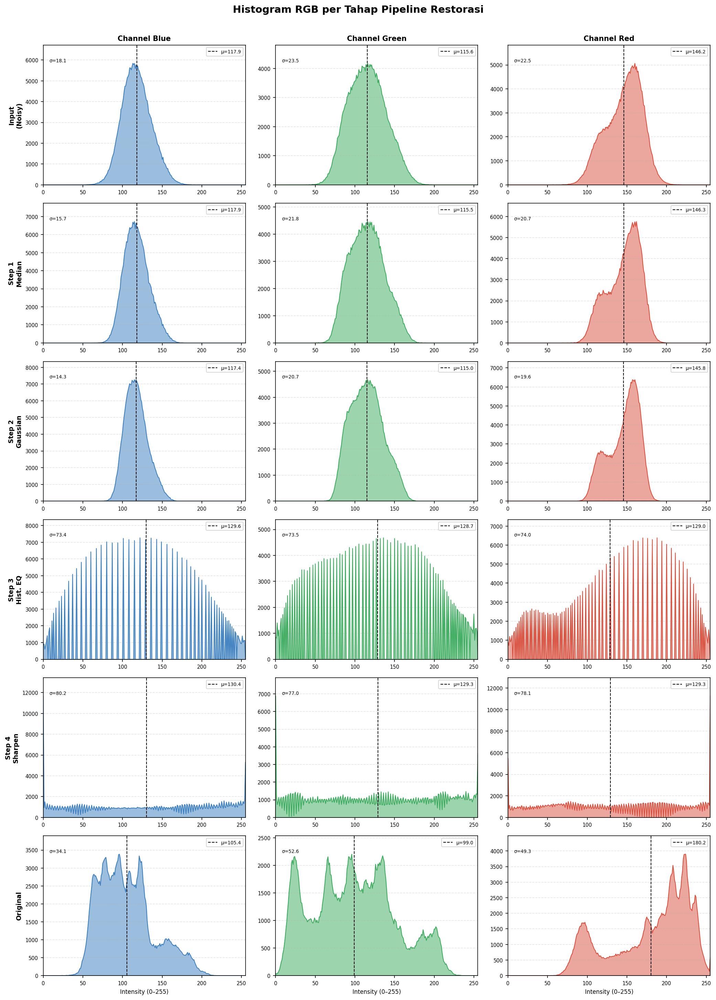
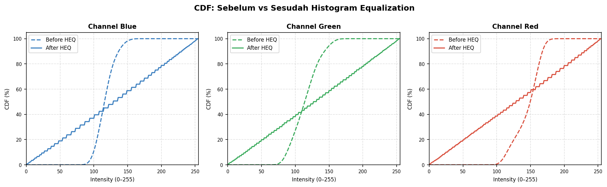

# Mini Project 1: Image Restoration
### Mata Kuliah: Pengolahan Citra dan Video
---

**Nama &nbsp;:** Devi Putri Sekar Arum    
**NRP &nbsp;&nbsp;&nbsp;:** 5024241049  
**Kelas &nbsp;:** A  

---

## Daftar Isi

1. [Deskripsi Masalah](#1-deskripsi-masalah)  
2. [Pipeline Restorasi](#2-pipeline-restorasi)  
3. [Landasan Teoritis](#3-landasan-teoritis)  
4. [Perbandingan Visual](#4-perbandingan-visual)  
5. [Analisis Histogram Tiap Tahap](#5-analisis-histogram-per-tahap)  
6. [Analisis CDF: Sebelum vs Sesudah HEQ](#6-analisis-cdf--sebelum-vs-sesudah-heq)  
7. [Evaluasi Kuantitatif: PSNR](#7-evaluasi-kuantitatif--psnr)  
8. [Analisis Hasil](#8-analisis-hasil)  
9. [Cara Menjalankan Program](#9-cara-menjalankan-program)

---

## 1. Deskripsi Masalah

Citra masukan yang diberikan merupakan citra Lena yang telah mengalami empat jenis degradasi secara simultan:

| No. | Jenis Degradasi | Karakteristik |
|-----|----------------|---------------|
| 1 | **Low Contrast** | Distribusi intensitas terkonsentrasi pada rentang sempit, sehingga detail visual tidak tampak jelas. |
| 2 | **Gaussian Noise** | Noise acak berdistribusi normal yang menambahkan variasi intensitas di seluruh piksel. |
| 3 | **Salt and Pepper Noise** | Piksel-piksel acak bernilai ekstrem (0 = hitam, 255 = putih) yang muncul secara sporadis. |
| 4 | **Blur** | Detail frekuensi tinggi (tepi, tekstur) teredam akibat proses convolusi dengan kernel perata. |

Tujuan restorasi adalah memulihkan citra mendekati kualitas citra aslinya dengan mengimplementasikan teknik-teknik pengolahan citra secara manual menggunakan NumPy, tanpa bergantung pada fungsi *built-in* pemrosesan OpenCV.

---

## 2. Pipeline Restorasi

Pipeline yang diimplementasikan terdiri atas empat tahap berurutan, di mana output setiap tahap menjadi input tahap berikutnya:

```
Input Noisy
    │
    ▼
┌─────────────────────────┐
│  Step 1: Median Filter  │  kernel 3×3 -> menghilangkan salt-and-pepper noise
└────────────┬────────────┘
             │
             ▼
┌──────────────────────────┐
│  Step 2: Gaussian Filter │  kernel 5×5, σ=1.0 -> meratakan Gaussian noise
└────────────┬─────────────┘
             │
             ▼
┌─────────────────────────────────┐
│  Step 3: Histogram Equalization │  per-channel -> memperbaiki low contrast
└────────────┬────────────────────┘
             │
             ▼
┌──────────────────────────────────┐
│  Step 4: Unsharp Masking        │  kernel 5×5, σ=1.0, α=1.5 -> sharpening
└────────────┬─────────────────────┘
             │
             ▼
Output Restored
```

### Alasan Pemilihan Urutan

Urutan pipeline dirancang berdasarkan pertimbangan berikut:

- **Median filter terlebih dahulu** sebelum Gaussian: Salt-and-pepper noise bersifat impulsif (outlier ekstrem). Jika Gaussian filter diaplikasikan lebih dulu, nilai outlier akan menyebar (*smearing*) ke piksel tetangganya dan semakin sulit dihilangkan. Median filter sebagai operasi non-linear yang robust terhadap outlier jauh lebih tepat sebagai langkah awal.

- **Gaussian filter setelah median**: Setelah noise impulsif dieliminasi, Gaussian filter digunakan untuk meratakan sisa noise Gaussian yang berdistribusi normal dan tersebar merata. Pada titik ini tidak ada lagi outlier yang dapat tersebar.

- **Histogram Equalization setelah denoising**: Jika HEQ dilakukan sebelum denoising, rentang dinamis histogram yang diperlebar akan sekaligus memperkuat noise. Melakukan HEQ setelah citra relatif bersih memastikan perentangan kontras dilakukan pada distribusi intensitas yang bermakna.

- **Unsharp Masking sebagai langkah terakhir**: Sharpening mempertegas komponen frekuensi tinggi. Jika dilakukan sebelum denoising, noise akan ikut diperkuat. Menempatkan unsharp masking di akhir pipeline memastikan hanya detail bermakna yang ditajamkan.

---

## 3. Landasan Teoritis

### 3.1 Median Filter

Median filter adalah filter spasial non-linear yang mengganti nilai setiap piksel dengan nilai median dari piksel-piksel di dalam window kernel. Secara matematis:

```
g(x, y) = median{ f(x+s, y+t) | (s,t) ∈ W }
```

di mana `W` adalah window kernel berukuran `k×k` dan `f` adalah citra masukan. Median filter efektif terhadap salt-and-pepper noise karena nilai median tidak terpengaruh oleh outlier ekstrem, berbeda dengan mean filter yang akan "tertarik" ke arah nilai ekstrem tersebut.

### 3.2 Gaussian Filter

Gaussian filter adalah filter linear low-pass yang menggunakan kernel berbobot Gaussian 2-D sebagai fungsi Point Spread Function (PSF):

```
h(x, y) = (1 / 2πσ²) · exp(−(x² + y²) / 2σ²)
```

Output diperoleh melalui konvolusi diskrit:

```
g(x, y) = Σ_s Σ_t f(x−s, y−t) · h(s, t)
```

Nilai σ mengontrol derajat smoothing: σ besar -> smoothing kuat; σ kecil -> smoothing halus. Implementasi menggunakan `pad_image` dengan mode `'edge'` untuk menangani piksel batas.

### 3.3 Histogram Equalization

Histogram Equalization (HEQ) bertujuan meratakan distribusi intensitas sehingga kontras global citra meningkat. Proses dilakukan melalui tiga langkah:

1. **Hitung histogram** `H(r)`: jumlah piksel untuk setiap level intensitas `r ∈ [0, 255]`.
2. **Hitung CDF (Cumulative Distribution Function)**:
   ```
   CDF(r) = Σ_{k=0}^{r} H(k)
   ```
3. **Mapping fungsi transformasi**:
   ```
   s = round( (CDF(r) − CDF_min) / (N − CDF_min) × (L−1) )
   ```
   di mana `N` adalah total piksel dan `L = 256`.

HEQ diterapkan secara independen pada setiap channel (B, G, R).

### 3.4 Unsharp Masking

Unsharp masking adalah teknik sharpening berbasis selisih antara citra asli dan versi yang telah diblur:

```
mask(x,y)      = f(x,y) − f_blurred(x,y)
g(x,y)         = f(x,y) + α · mask(x,y)
```

di mana `α` (alpha) adalah faktor penguatan detail (`α = 1.5` pada implementasi ini). Mask merepresentasikan komponen frekuensi tinggi (detail, tepi). Menambahkannya kembali ke citra asli menghasilkan efek penajaman. Blur sementara dihasilkan dari Gaussian filter dengan parameter kernel 5×5 dan σ=1.0.

---

## 4. Perbandingan Visual

### 4.1 Sebelum dan Sesudah Restorasi

| Citra Noisy (Input) | Citra Restored (Output) | Citra Original (Referensi) |
|:-------------------:|:-----------------------:|:--------------------------:|
|  |  |  |

### 4.2 Perbandingan Visual Tiap Tahap Pipeline



> **Gambar 4.2.** Perbandingan visual citra pada setiap tahap pipeline: (a) Input Noisy, (b) Setelah Median Filter, (c) Setelah Gaussian Filter, (d) Setelah Histogram Equalization, (e) Setelah Unsharp Masking, (f) Citra Original.

---

## 5. Analisis Histogram per Tahap



> **Gambar 5.1.** Histogram distribusi intensitas channel R, G, B pada setiap tahap pipeline. Kolom menunjukkan channel warna; baris menunjukkan tahap pemrosesan. Garis putus-putus hitam menandai nilai rata-rata intensitas (μ), sedangkan nilai standar deviasi (σ) ditampilkan di pojok kiri atas.

### Observasi

**Input (Noisy):**  
Histogram memperlihatkan distribusi yang sempit dan terkonsentrasi pada rentang intensitas rendah hingga menengah (~80–160), mengkonfirmasi adanya *low contrast*. Terdapat pula spike pada nilai 0 dan 255 akibat salt-and-pepper noise.

**Setelah Median Filter:**  
Spike pada nilai 0 dan 255 hilang secara signifikan, menandakan eliminasi salt-and-pepper noise yang berhasil. Distribusi histogram mulai sedikit melebar.

**Setelah Gaussian Filter:**  
Histogram menunjukkan pemulusan (*smoothing*) distribusi lebih lanjut. Variasi antar intensitas yang berdekatan berkurang, terlihat dari histogram yang lebih "halus" dibandingkan tahap sebelumnya.

**Setelah Histogram Equalization:**  
Distribusi intensitas tersebar jauh lebih merata di seluruh rentang 0–255. Ini merupakan indikator keberhasilan HEQ dalam memperbaiki kontras global. Nilai μ bergeser mendekati 128 (tengah rentang).

**Setelah Unsharp Masking (Final):**  
Histogram tetap terdistribusi luas dengan sedikit perubahan pada ekor distribusi, menandakan penambahan komponen frekuensi tinggi (detail tepi) tanpa mengubah distribusi global secara drastis.

---

## 6. Analisis CDF: Sebelum vs Sesudah HEQ



> **Gambar 6.1.** Perbandingan CDF setiap channel warna sebelum (garis putus-putus) dan sesudah (garis solid) Histogram Equalization.

### Interpretasi

CDF ideal untuk citra dengan kontras sempurna adalah garis diagonal lurus dari (0,0) ke (255,100%). Sebelum HEQ, kurva CDF menunjukkan kenaikan curam di rentang intensitas sempit yang mengkonfirmasi bahwa sebagian besar piksel terkonsentrasi pada rentang nilai tertentu. Setelah HEQ, kurva CDF mendekati garis diagonal, menandakan distribusi intensitas yang jauh lebih merata di seluruh rentang 0–255.

---

## 7. Evaluasi Kuantitatif: PSNR

PSNR (*Peak Signal-to-Noise Ratio*) digunakan sebagai metrik kuantitatif untuk mengukur kemiripan citra hasil restorasi dengan citra referensi (original). PSNR dihitung sebagai:

```
PSNR = 10 · log₁₀(MAX² / MSE)
```

di mana `MAX = 255` dan `MSE` adalah rata-rata kuadrat error per piksel.

| Tahap | Deskripsi | PSNR (dB) |
|-------|-----------|:---------:|
| Input | Citra noisy (baseline) | 16.21 |
| Step 1 | Setelah Median Filter | 16.45 |
| Step 2 | Setelah Gaussian Filter | 16.50 |
| Step 3 | Setelah Histogram Equalization | 13.30 |
| Step 4 | Setelah Unsharp Masking (Final) | 12.45 |

> **Catatan:** Penurunan PSNR pada Step 3 adalah fenomena yang *expected* dan tidak mengindikasikan kegagalan. HEQ mengoptimalkan distribusi intensitas untuk persepsi visual manusia, bukan untuk meminimalkan pixel-level error terhadap citra referensi. Secara visual, citra setelah HEQ terlihat jauh lebih jelas dan berkontrास tinggi meskipun PSNR-nya lebih rendah. Ini merupakan keterbatasan inherent metrik PSNR dalam mengevaluasi operasi transformasi non-linear seperti HEQ.

---

## 8. Analisis Hasil

### 8.1 Apa yang Berhasil

- **Eliminasi salt-and-pepper noise** melalui Median Filter 3×3 berjalan sangat efektif. Artefak piksel hitam-putih acak pada citra input berhasil dihilangkan hampir sepenuhnya tanpa mengaburkan tepi secara berlebihan.

- **Reduksi Gaussian noise** melalui Gaussian Filter 5×5 memberikan efek smoothing yang memadai. Variasi intensitas acak yang bersifat distribusi normal berhasil diratakan, menghasilkan citra yang lebih halus.

- **Peningkatan kontras** melalui Histogram Equalization secara signifikan memperluas rentang dinamis citra. Fitur-fitur yang sebelumnya "tenggelam" dalam rentang intensitas sempit menjadi lebih terlihat dan dapat dibedakan secara visual.

- **Pemulihan ketajaman** melalui Unsharp Masking berhasil mempertajam tepi dan detail tekstur yang sempat teredam oleh proses smoothing sebelumnya. Penggunaan nilai α=1.5 memberikan peningkatan ketajaman yang terasa tanpa menimbulkan artefak *halo* yang mengganggu.

### 8.2 Keterbatasan dan Potensi Peningkatan

- **Histogram Equalization per-channel** dapat menyebabkan pergeseran warna (*color shift*) karena setiap channel diproses secara independen tanpa mempertimbangkan relasi antar channel. Alternatif yang lebih baik adalah menerapkan HEQ hanya pada channel luminance dalam ruang warna YCbCr atau HSV, sehingga distribusi warna asli tetap terjaga.

- **Bilateral Filter** dapat menjadi alternatif yang lebih unggul dibandingkan Gaussian Filter karena ia meratakan noise sambil *mempertahankan tepi* (*edge-preserving smoothing*). Gaussian Filter yang murni low-pass akan mengaburkan tepi bersama noise.

- **CLAHE (Contrast Limited Adaptive Histogram Equalization)** merupakan pengembangan dari HEQ yang membagi citra ke dalam sub-region (*tiles*) dan membatasi penguatan kontras lokal (*clip limit*), sehingga menghindari *over-enhancement* pada area yang sudah memiliki kontras tinggi.

- **Wiener Filter** di domain frekuensi (berbasis FFT) secara teoritis optimal untuk restorasi citra yang terdegradasi oleh blur dengan PSF yang diketahui, dan dapat memberikan PSNR yang lebih tinggi dibandingkan pendekatan spasial murni.

- **Parameter tuning** (ukuran kernel, σ, α) saat ini dipilih secara heuristik. Pendekatan *grid search* berbasis metrik SSIM (*Structural Similarity Index*) atau PSNR dapat digunakan untuk menemukan parameter optimal secara sistematis.

---

## 9. Cara Menjalankan Program

### 9.1 Persyaratan Sistem

```
Python  >= 3.8
numpy
opencv-python
matplotlib
```

### 9.2 Instalasi Dependencies

```bash
pip install numpy opencv-python matplotlib
```

### 9.3 Struktur Direktori

```
MP1_IMAGE RESTORATION/
├── input/
│   └── lena_noisy.png          # Citra input (rusak)
├── output/
│   ├── 1_median.png            # Hasil setelah Median Filter
│   ├── 2_gaussian.png          # Hasil setelah Gaussian Filter
│   ├── 3_histogram_equalization.png # Hasil setelah Histogram Equalization
│   ├── 4_sharpening.png        # Hasil setelah Unsharp Masking
│   ├── lena_restored.png       # Citra hasil akhir restorasi
│   ├── pipeline_comparison.png # Visualisasi perbandingan visual pipeline
│   ├── histogram_comparison.png# Histogram RGB per tahap pipeline
│   └── cdf_comparison.png      # CDF sebelum vs sesudah HEQ
├── README.md
└── restoration.py
```

### 9.4 Menjalankan Program

```bash
# Clone atau download repository, lalu:
cd MP1_IMAGE_RESTORATION

# Pastikan citra input tersedia di folder input/
# Jalankan skrip utama:
python restoration.py
```

### 9.5 Output yang Dihasilkan

Setelah program selesai dijalankan, folder `output/` akan berisi:

| File | Keterangan |
|------|-----------|
| `1_median.png` | Citra setelah Median Filter |
| `2_gaussian.png` | Citra setelah Gaussian Filter |
| `3_histogram_equalization.png` | Citra setelah HEQ |
| `4_sharpening.png` | Citra setelah Unsharp Masking |
| `lena_restored.png` | Citra hasil restorasi final |
| `pipeline_comparison.png` | Visualisasi komparatif semua tahap pipeline |
| `histogram_comparison.png` | Histogram RGB per tahap pipeline |
| `cdf_comparison.png` | Perbandingan CDF sebelum vs sesudah HEQ |

Program juga mencetak laporan PSNR di terminal untuk setiap tahap pipeline sebagai evaluasi kuantitatif.

---

*Mini Project 1: Pengolahan Citra dan Video*
