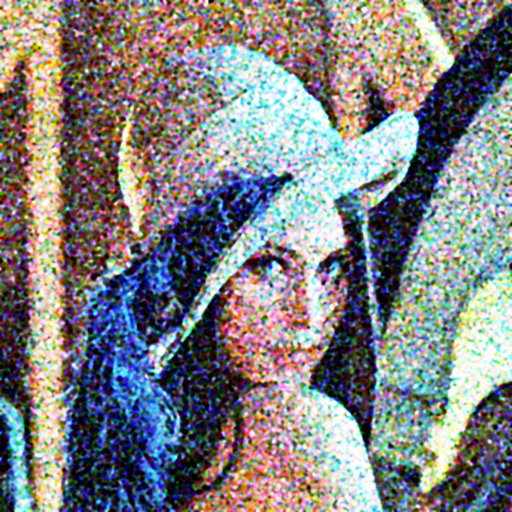
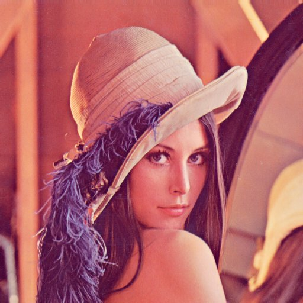

# Mini Project 1 : Image Restoration

**Mata Kuliah:** Pengolahan Citra dan Video  
**Nama:** Devi Putri Sekar Arum  
**NRP:** 5024241049

---

## Pipeline Restorasi

Citra rusak mengalami empat jenis degradasi: **low contrast**, **Gaussian noise**, **salt-and-pepper noise**, dan **blur**. Pipeline yang digunakan menangani setiap masalah secara berurutan:

| Langkah | Teknik | Alasan Pemilihan |
|---------|--------|-----------------|
| 1 | **Median Filter (5×5)** | Sangat efektif menghilangkan salt-and-pepper noise karena median tidak terpengaruh outlier ekstrem (piksel hitam/putih acak). Dilakukan pertama agar noise impulsif tidak menyebar ke langkah berikutnya. |
| 2 | **Gaussian Filter (7×7, σ=1.2)** | Meratakan sisa Gaussian noise setelah median filter. Kernel 7×7 dengan σ=1.2 memberikan smoothing yang cukup tanpa terlalu mengaburkan detail. |
| 3 | **Histogram Equalization (kanal Y)** | Memperbaiki kontras yang rendah dengan meratakan distribusi intensitas. Dilakukan pada kanal luminance (Y di YCbCr) saja agar warna tidak terdistorsi. |
| 4 | **Unsharp Masking (5×5, σ=1.0, amount=1.2)** | Mengembalikan ketajaman detail yang hilang akibat blur dan proses smoothing. Threshold=5 mencegah penguatan noise residual. |

### Alasan Urutan Pipeline

- Median filter **dahulu** → menghilangkan outlier sebelum Gaussian filter (kalau dibalik, noise impulsif akan menyebar).  
- Gaussian filter **setelah** median → meratakan noise yang tersisa tanpa efek outlier.  
- HEQ **setelah** denoising → menghindari amplifikasi noise saat merentangkan histogram.  
- Unsharp masking **terakhir** → mempertajam hasil akhir setelah semua noise dibersihkan.

---

## Perbandingan Visual

### Sebelum vs Sesudah

| Noisy Input | Restored Output | Original |
|:-----------:|:---------------:|:--------:|
|  |  |  |

> Lihat juga `output/comparison.png` untuk perbandingan lengkap beserta histogram.

### PSNR Progression

| Tahap | PSNR vs Original |
|-------|-----------------|
| Input (noisy) | 16.21 dB |
| Setelah Median Filter | 16.56 dB |
| Setelah Gaussian Filter | 16.54 dB |
| Setelah Histogram EQ | 15.40 dB |
| Setelah Unsharp Masking | 15.29 dB |

> **Catatan:** Penurunan PSNR setelah HEQ adalah hal yang wajar — HEQ mengoptimalkan *persepsi visual* (kontras), bukan *pixel-level accuracy*. Secara visual hasil terlihat lebih jelas meskipun PSNR turun sedikit.

---

## Analisis

### Apa yang Berhasil
- **Median filter** sangat efektif menghilangkan speckle / salt-and-pepper noise.
- **Gaussian filter** berhasil meratakan tekstur noise yang tersisa.
- **Histogram equalization** secara signifikan meningkatkan kontras dan saturasi warna.
- **Unsharp masking** mengembalikan ketajaman tepi (pinggiran topi, rambut) tanpa artefak berlebihan berkat threshold.

### Apa yang Bisa Ditingkatkan
- **Bilateral filter** (manual) bisa menggantikan Gaussian filter — ia meratakan noise sambil *mempertahankan tepi* lebih baik.
- **CLAHE (Contrast Limited AHE)** bisa menggantikan HEQ global untuk menghindari over-enhancement di area terang.
- **Wiener filter** di domain frekuensi (FFT manual) cocok untuk blur model yang diketahui, berpotensi meningkatkan PSNR lebih tinggi.
- Tuning parameter (`kernel_size`, `sigma`, `amount`) secara otomatis menggunakan grid-search terhadap metrik SSIM.

---

## Cara Menjalankan

### Requirements
```
Python >= 3.8
numpy
opencv-python
matplotlib
```

Install dependencies:
```bash
pip install numpy opencv-python matplotlib
```

### Struktur Direktori
```
mp1-image-restoration/
├── README.md
├── restoration.py
├── input/
│   ├── lena_noisy.png
│   └── lena_ori.png
└── output/
    ├── lena_restored.png
    └── comparison.png
```

### Menjalankan Program
```bash
python restoration.py
```

Output akan disimpan di folder `output/`:
- `lena_restored.png` — citra hasil restorasi
- `comparison.png` — perbandingan visual + histogram (noisy, restored, original)
